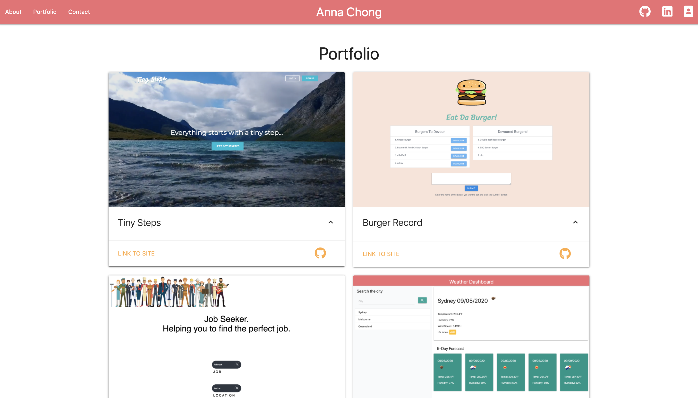

# Portfolio

## Description

A responsive portfolio were components on the page adjust according to the screen size. 
It contains three pages which include:

- About me
- Porfolio: includes real projects coded by Anna
- Contact Information

Everything was possible because there was always an answer on the internet.

## Usage

## Have a look yourself

https://acho9138.github.io/Portfolio/

## Credits

Thank you to the following resources to make this website possible:

- The Coding Bootcamp at University of Sydney
- MaterializeCSS
- MDN
- Font Awesome